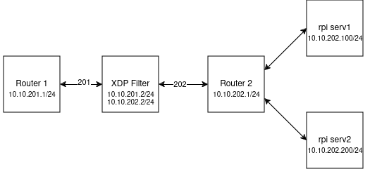
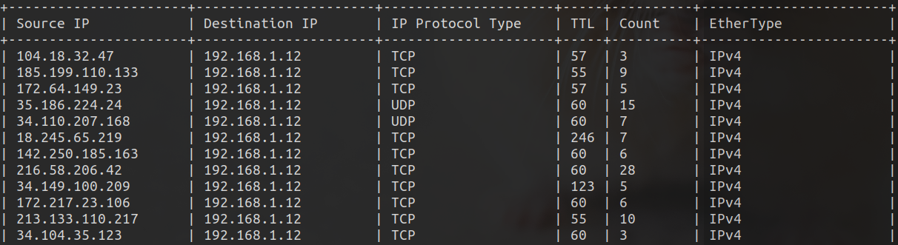

# MAOYK-2024-BPF-XDP
:clipboard: **XDP Programs and Network Configurations** crafted during a software bootcamp.

:penguin: **Software Bootcamp:** [Linux Internal Structure: Introduction to BPF/XDP](https://kamp.linux.org.tr/2024-yaz/kurslar/linuxun-ic-yapisi-bpf-xdp-ye-giris/)

## 🌐 Network Topology 

The network topology implemented during the bootcamp was designed using **Raspberry Pi 4 devices**.

## 🔧 Network Configurations

Explore the detailed configurations for our routers:
- **[Router 2 Configurations](network/router-2/conf.md)**

## ⚡ XDP Programs

For insights on compiling, loading, and managing maps, dive into the **Compile & Load & Look** documentation below.

📜 **[Compile & Load & Look](xdp/CLL.md)**

### 📦 Packet Counter
This program is an **eBPF application** that counts incoming IP packets using **XDP (eXpress Data Path)**. It records vital information such as:
- **Source IP**
- **Destination IP**
- **Ethernet Protocol**
- **IP Protocol**
- **TTL**
- **Packet Count** for each unique combination.

📝 You can find the source code for the Packet Counter program here: **[Packet Counter Program](xdp/programs/ip/ip_counter.c)**.

📊 To read the map, check out the **[Packet Counter MAP Reader](xdp/programs/ip/ip_counter_map_reader.c)**.

## :camera: Running Program Instance

### :trollface: Troll Program 

This program is an **eBPF application** that selectively drops incoming packets targeting a specified IP address at a defined random rate using **XDP (eXpress Data Path)**. It processes Ethernet and VLAN headers and ensures that only packets with the defined target IP are subject to the drop rate.

📝 You can find the source code for the XDP Troll program here: **[XDP Troll Program](xdp/programs/troll/troll.c)**.

